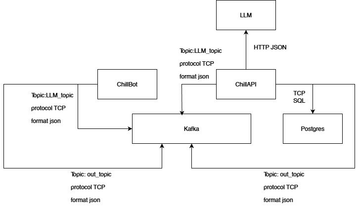
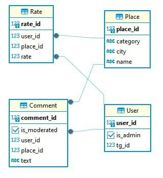
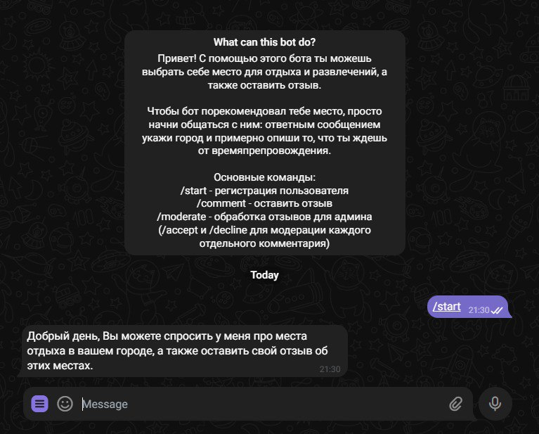
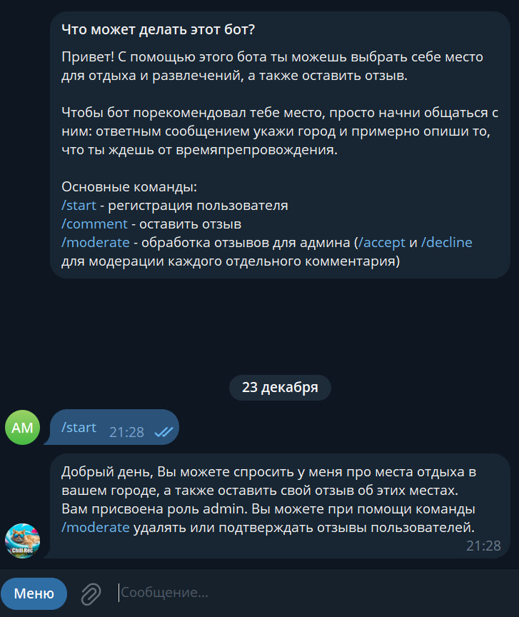
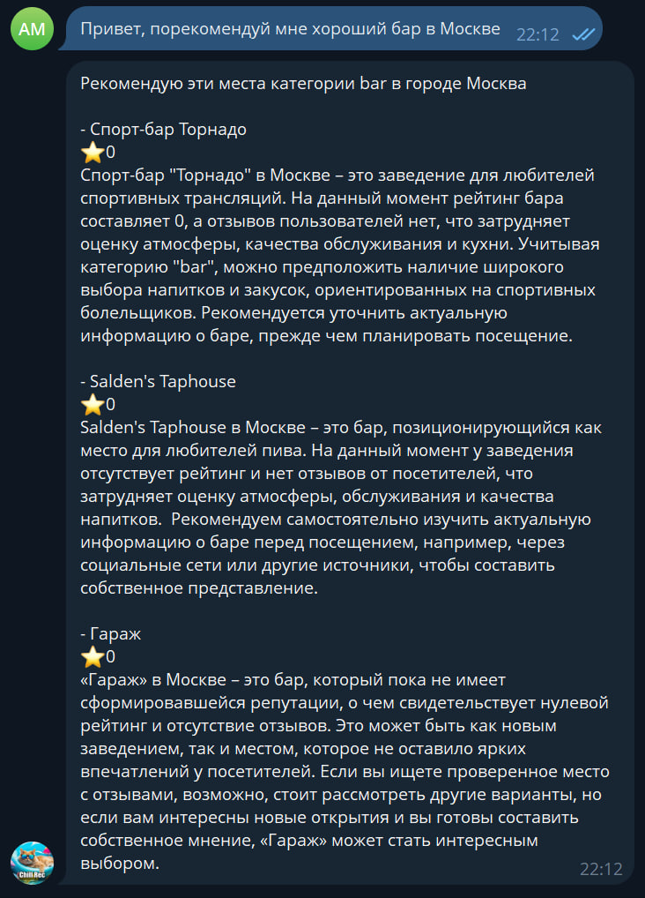
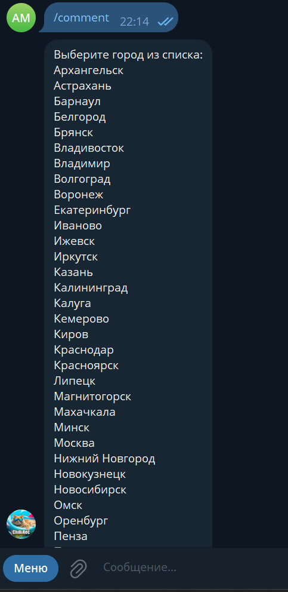
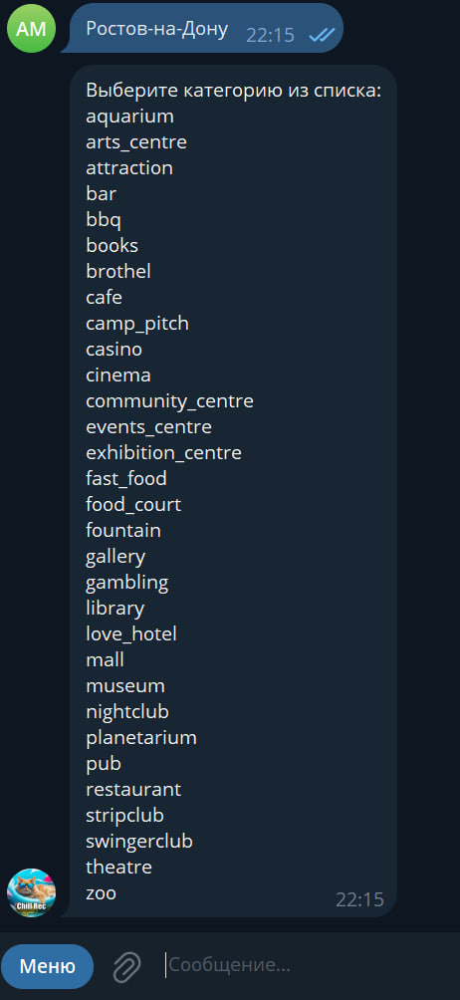
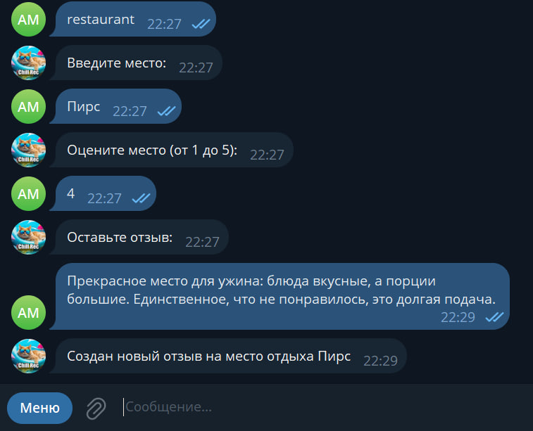

# Курсовой проект по дисциплине Python: Продвинутый уровень
## Кейс: Диалоговая система для рекомендаций мест отдыха и развлечений на основе предпочтений пользователей и их опыта.

### Состав команды:
Соколов Арсений М8О-103СВ-25<br>
Марченко Алексей М8О-102СВ-25<br>

### Проблема кейса:
Основной проблемой являлся поиск данных, на основе которых можно было бы сформировать идею рекомендательной системы и в то же самое время предусмотреть возможность пользовательского контента. Сложнее всего ситуация обстояла с получением реальных отзывов.

### Видение решения:
Было принято решение использовать API OpenStreetMap, которое совмещает достаточно широкий охват размеченных данных по заведениям и их категориям в городах России. Мы отобрали 36 городов России с населением больше полумиллиона и Минск. Также мы отобрали 31 категорию заведений, которые соответствовали тематики задания. Всего в БД у нас получилось около 50,000 уникальных заведений с названием, городом и категорией.

Сервис OpenStreetMap не предоставлял информацию по комментариям и рейтингу, поэтому мы решили реализовать возможность их добавления в качестве пользовательского контента системы. Саму рекомендательную систему реализовали на основе поиска заведений с наивысшим пользовательским рейтингом по заданному городу и заведению. В целях обеспечения естественного диалога был написан телеграм-бот с интеграцией LLM gemma-3-27b, развернутой на Hugging Face Hub, с заданными промптами для выявления оптимальной категории и города из пользовательского запроса с возможностью обработки ошибок, кэшированием истории диалога и уточняющими вопросами со стороны модели. Для вывода обобщенной информации по описанию заведений была использована вышеописанная LLM уже для суммаризации пользовательских отзывов.

По заданному городу, категории и названию места пользователь может оставить комментарий и рейтинг заведения, которые будут использованы в дальнейшем рекомендательной системой.

Ролевая система основывается на разделении пользователей на модераторов и обычных юзеров. Если id пользователя в telegram добавлено в БД, то ему предоставляется возможность обрабатывать оставленные отзывы, принимая или отклоняя их, начиная с самого раннего. Рекомендательная система использует в итоге только промодерированные отзывы.

### Архитектура сервиса

Архитектура системы построена по принципу распределённого микросервисного взаимодействия с чётким разделением ответственности между компонентами. Вся логика обработки запросов вынесена в отдельные сервисы, бот выступает используется для ввода-вывода, преобразующий пользовательские сообщения в стандартизированные объекты и отправляющий их в Kafka. Ответы от системы поступают через отдельный Kafka-консьюмер, который асинхронно обрабатывает их и направляет обратно пользователю через Telegram API.

Состояние диалога с пользователем управляется с помощью конечного автомата для сценариев оставления отзыва и отдельного механизма MessagesManager — для рекомендательного диалога. MessagesManager хранит в памяти историю последнего запроса пользователя, включая извлечённый контекст, промежуточные параметры (город, категория), статус обработки и текстовые фрагменты, накапливаемые от LLM. При успешной обработке или фатальной ошибке состояние сбрасывается.

Все данные о заведениях загружены в собственную базу данных, не подключённую напрямую к Telegram-боту. Пользовательский контент (рейтинги и отзывы) записывается в отдельную таблицу. Модерация реализована как очередь: модератор получает самый старый неподтверждённый отзыв, и его решение в боте фиксируется через команды телеграм, которые также преобразуются в RequestMessage и отправляются в Kafka.

Взаимодействие с LLM  выполняется в отдельном обработчике, который берёт запросы из Kafka, применяет промпты для извлечения сущностей или генерации суммаризации коментариев юзеров и возвращает структурированный ответ в формате json как строку.

При первом взаимодействии создаётся пользовательский аккаунт с флагом is_admin, значение которого определяется сопоставлением ID с белым списком из env. Проверка выполняется в момент отправки команды модерации.

### Диаграмма БД


### Тест-кейсы и примеры интерфейса

#### 1. Старт пользователя



#### 2. Старт модератора



#### 3. Пример рекомендации LLM


   
#### 4. Пример добавления комментария
4.1 Выбор города



4.2 Выбор категории



4.3 Выбор места, его оценка и оставление отзыва



#### 5. Пример модерации комментариев


### Гайд по деплою

1. Скопировть .env файл и поменять секреты на свои:

```
cp .env.example .env
```

2. Запустить проект в docker-compose

```
docker-compose up
```

3. Чат-бот доступен по ссылке:

```
https://t.me/Chill_Rec_Bot
```


